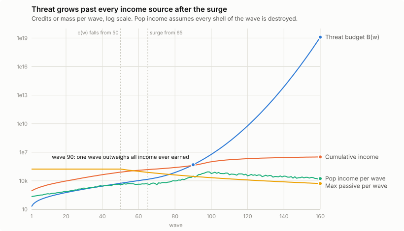
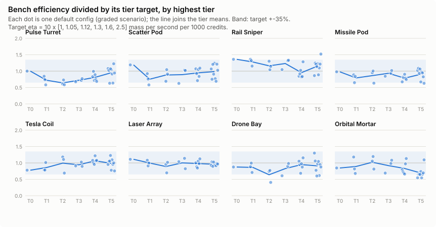
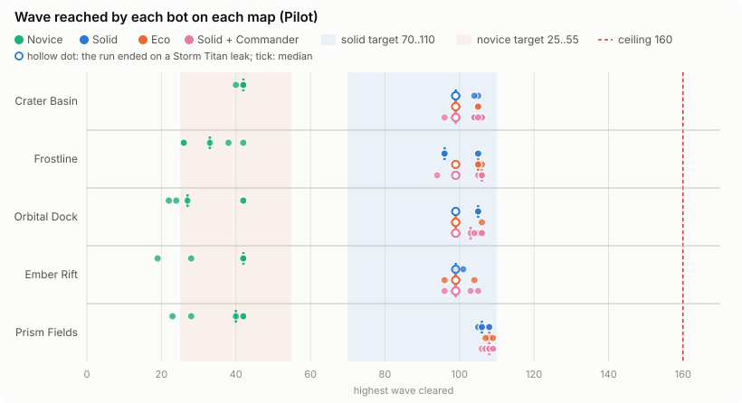

# SHARDSTORM: Balance and Economic Soundness

This document explains how the SHARDSTORM economy works, proves the claims that make it sound as an endless game, and shows what the bots measure. The numeric contract is docs/ECONOMY.md; every constant lives in `src/data/economy.js`. Everything below the headings marked *generated* is written by `tools/balance-report.mjs` from real runs, so the document can be reproduced:

```
node tools/balance.mjs --sweep --json out/balance/report.json   # soundness suite + bot sweep (228 runs, about 45 minutes on 22 workers)
node tools/balance-report.mjs                                   # charts in docs/balance/*.svg, tables below
node tools/balance-report.mjs --check                           # exit 1 if this document is out of date
```

`tools/balance.mjs` exits non-zero on any violation of the claims in section 3 and the targets in section 4.

## 1. The model in plain language

A run is a loop of two flows.

**Credits in.** Every shell (one layer of a meteor or a ship hull) that breaks pays `c(w)` credits, where `w` is the wave it belongs to. `c(w)` is 1 up to wave 50 and then falls as `(50/w)^3`: the storm floods the market with ore. Clearing a wave pays a flat `200 + w`. Mining Rigs, vaults and Rail supply drops pay a fixed amount per wave, also times `c(w)`. Nothing else ever creates credits.

**Credits out.** Credits buy towers and upgrades. A tower turns credits into damage at a rate that rises with tier (the bench efficiency, section 3.5). Selling returns 70% of what was paid (100% for a purchase undone before the next wave launches).

**Threat.** Wave `w` carries a mass budget `B(w)`: the total hit points of everything in it. `B` follows Bloons TD6's round curve (a power law times 5.1% growth per wave) up to wave 65, and from there a **surge** factor `exp(0.0032 x (w - 65)^2)` makes its logarithm grow quadratically. Every twentieth wave adds a Storm Titan, a single boss hull that ends the run if it reaches the Core.

**Why the storm always wins.** Income is roughly proportional to the number of shells in a wave times `c(w)`. Past wave 50 `c(w)` falls like `w^-3`, and past about wave 100 the wave hits its 300-spawn cap, so the shell count stops growing while `B(w)` keeps climbing by multiplying ship hulls. The defense a player can afford grows roughly with cumulative income; the threat grows faster than any exponential. The chart below shows the gap: all the credits a perfect player could ever earn are overtaken by a single wave's mass shortly after wave 90.



**Where skill shows.** Early waves are generous (a 200-credit wave bonus, stretched early spawns, gentle first doses of every new enemy), so the difference between players is how well they convert credits into coverage of every damage type, detection and ship damage. A random cheap defense (the novice bot) dies between waves 17 and 52 at the first threat it cannot answer: a dense Rose or Amber stream, or the first all-Phantom wave (43), where most novice runs end. A defense that buys efficiently (the solid bot) reaches the surge, where the flood and the wave 100 Titan end the run, almost always between waves 94 and 109. No strategy survives past about wave 120, because by then one wave outweighs every credit the game has ever paid.

### Constants (generated)
<!-- gen:constants -->
| Constant | Value | Where |
|---|---|---|
| Starting credits | 650 | ECONOMY 1.4 |
| c(w) | 1 up to wave 50, then (50/w)^3 | ECONOMY 1.1 |
| Wave bonus | 200 + w | ECONOMY 1.2 |
| Surge | exp(0.0032 x max(0, w - 65)^2) up to wave 165, then along its tangent (finite numbers only) | ECONOMY 4.1 |
| Titan hull | 0.7 x sqrt(tier) x B(w) / S(w)^0.5, w = 20 x tier | ECONOMY 4.6 |
| Global-range SHIP grading | 0.7 x target | ECONOMY 3.2 |
| Specter scout hull | 0.2 x hull, empty hold | ECONOMY 4.8 |
<!-- /gen:constants -->

## 2. The math

Notation: `w` wave, `c(w)` bounty factor, `B(w)` mass budget, `S(w)` surge, `H(w)` hull multiplier, `D(w)` spawn duration, `v(w)` speed ramp, `N_max` the most towers any map can hold.

**Income per wave.** If every shell of wave `w` is destroyed, the wave pays

```
I(w) = shells(w) x c(w) + 200 + w + P(w)
```

where `shells(w)` is the number of shells in the wave (fixed by the wave generator) and `P(w)` the passive income. Cumulative income `C(w) = 650 + sum I(k)` for k <= w is an upper bound on everything a player can have spent by wave `w` (a leak only loses shells, it never adds any).

**Passive income.** Each Rig pays `ore x c(w)`; a vault adds `min(balance, cap) x rate x c(w)`; a Supply Drop rail pays `drops x value x c(w)`. With at most 10 Rigs, each tier 5 once per game, and at most `N_max` Rails:

```
P(w) <= (R_max + S_max) x c(w)
```

with `R_max` the best legal 10-Rig fleet at c = 1 and `S_max` every supply drop a map packed with Rails could pay (section 3.2 prints both). The Refinery pays `k x c(w)` per shell destroyed in its radius with `k <= 0.25`, so it is bounded by a quarter of the pop income.

**Threat.**

```
B(w) = 19 x w^0.81 x 1.0514^w x S(w)
log B(w) = log 19 + 0.81 log w + w log 1.0514 + K x max(0, w - 65)^2      (K = 0.0032, up to wave 165)
```

Authored waves 1 to 40 are hand-built within 20% of `B(w)`; procedural waves are generated to within 5%. When 300 spawns of the strongest unlocked enemies cannot carry `B(w)`, every ship hull in the wave is multiplied by `H(w) = (B(w) - meteorMass) / hullMass`, which is exact because mass is linear in `H`.

**Titans.** `titanHp(t) = 0.7 x sqrt(t) x B(20t) / sqrt(S(20t))`: the early Titans are 0.7 to 1.2 times their wave's mass, and after the surge they rise with its square root, so the Titan remains a single-target check (docs/ECONOMY.md 4.6).

**Defense capacity.** A tower config with total cost `k` destroys `eta x k / 1000` mass per second in its bench scenario (section 3.5). Efficiency `eta` is bounded above by the best tier 5 (about 35 on the bench), and a map holds at most `N_max` towers, so the whole defense destroys at most `DPS_max` mass per second, a constant of the map.

### Economy by wave (generated)
Pop income assumes every shell of the wave is destroyed; cumulative income starts at the 650 starting credits.

<!-- gen:economy -->
| Wave | B(w) | Wave mass | Shells | c(w) | Pop + bonus | Cumulative income | B / cumulative | H | Titan |
|---|---|---|---|---|---|---|---|---|---|
| 1 | 20 | 20 | 20 | 1.000 | 221 | 871 | 0.023 | 1.00 |  |
| 10 | 203 | 230 | 230 | 1.000 | 440 | 3.8k | 0.053 | 1.00 |  |
| 20 | 586 | 515 | 515 | 1.000 | 735 | 9.6k | 0.061 | 1.00 | 410 |
| 30 | 1.3k | 1.5k | 1.5k | 1.000 | 1.7k | 21k | 0.063 | 1.00 |  |
| 40 | 2.8k | 2.8k | 2.5k | 1.000 | 2.7k | 44k | 0.064 | 1.00 | 2.8k |
| 50 | 5.5k | 5.5k | 4.0k | 1.000 | 4.2k | 81k | 0.068 | 1.00 |  |
| 60 | 11k | 11k | 7.1k | 0.579 | 4.4k | 128k | 0.083 | 1.00 | 13k |
| 70 | 21k | 21k | 9.8k | 0.364 | 3.9k | 176k | 0.122 | 1.00 |  |
| 80 | 75k | 75k | 38k | 0.244 | 9.6k | 250k | 0.299 | 1.00 | 73k |
| 90 | 489k | 488k | 181k | 0.171 | 31k | 426k | 1.149 | 1.00 |  |
| 100 | 6.0M | 6.0M | 463k | 0.125 | 58k | 999k | 6.002 | 3.34 | 1.3M |
| 110 | 138.4M | 138.4M | 463k | 0.094 | 44k | 1.6M | 85 | 84 |  |
| 120 | 6.0G | 6.0G | 463k | 0.072 | 34k | 2.1M | 2.9k | 3.7k | 81.5M |
| 130 | 492.7G | 492.7G | 676k | 0.057 | 39k | 2.5M | 198k | 295k |  |
| 140 | 7.6e13 | 7.6e13 | 676k | 0.046 | 31k | 2.8M | 27.4M | 30.8M | 17.4G |
| 150 | 2.2e16 | 2.2e16 | 676k | 0.037 | 25k | 3.0M | 7.4G | 12.7G |  |
| 160 | 1.2e19 | 1.2e19 | 552k | 0.031 | 17k | 3.2M | 3.8T | 5.0T | 1.3e13 |
<!-- /gen:economy -->

## 3. Soundness claims and proofs

### 3.1 No arbitrage

**Claim.** Let `W` be the player's wealth (credits plus the sell value of every tower, vault balances in full) and `E` the income the storm paid (bounty, wave bonus, Rig ore, vault interest, supply drops, Refinery). Then `W - E` never increases, whatever the player does and whenever abilities fire. In words: no sequence of actions creates credits.

**Proof.** The simulation changes credits in exactly these places (`src/sim/**`, checked by search): the pop bounty, the wave bonus, the Rig/vault/supply payout, the Refinery bonus, selling, buying, and the debug `giveCash` hook, which flags the run as debug and never writes records. The first four are income, so they raise `W` and `E` by the same amount. For the player's own actions:

1. *Buying* a tower or an upgrade for `p` credits lowers credits by `p` and raises the sell value by `0.7 p` (or `p` while undoable): `W` falls by `0.3 p` or stays equal.
2. *Selling* returns exactly the sell value, which leaves `W` unchanged.
3. *Undo* refunds 100% only for purchases made in the current build phase, before any wave has launched since, so the refund equals what was paid and no income happened in between.
4. *Discounts.* A Beacon discount lowers a purchase price, but the discount is never applied to Rigs or Beacons (so it cannot feed income or itself), discounts do not stack, and a discounted purchase spends the Beacon's undo refund: the Beacon then sells for 70%. The loop "place Beacon, buy discounted, undo Beacon" therefore costs at least 30% of the Beacon, more than any discount it gave.
5. *Vaults.* Interest is paid only on the balance up to the cap and is scaled by `c(w)` (it is income), withdrawing moves the balance to credits one for one, and a vault balance is counted in `W` in full, so withdraw and deposit loops change nothing.
6. *Abilities* never touch credits directly (no ability calls a payout; checked by search in `src/data/**`). They destroy meteors, whose bounty is income, or buff towers.
7. *Save and load* restore credits, paid amounts and vault balances exactly.
8. *Bounty conservation.* The argument above counts bounty as income, so it would not notice a defense that makes the storm pay for the same shell twice. Two mechanics create shells on the field: nanite regrowth and the Maw's volleys. A regrown shell and its children share the bounty the shell had before it regrew, and the Maw pays only for the volleys of one full-speed crossing (docs/ECONOMY.md 1.1). So every wave pays bounty for at most the shells in its groups, its Titan and the Maw's paid volleys.

Every action therefore leaves `W - E` equal or lower. **Checked by** `tools/balance.mjs` section 1: targeted undo, sell, discount, vault and save/load tests, every activated ability in the game fired at the first usable tick, at random ticks and late in the wave (with Commanders at level 20), and thousands of random commands across all maps and difficulties, asserting `W - E` never rises by more than float rounding. The ability runs also count paid pops per wave and assert they never exceed the shells the wave sent; `tools/simtest.mjs` (bounty conservation) holds a nanite family frozen while chipping it, stalls a Maw, and checks both pay nothing extra.

### 3.2 Bounded passive income

**Claim.** Passive income per wave is at most a constant times `c(w)`, and after wave 50 its share of the threat falls toward zero.

**Proof.** Rigs are capped at 10 alive, each tier 5 upgrade exists at most once per game, and each Rig's ore and vault interest are fixed by its tier, so the Rig total is at most `R_max x c(w)`. Supply drops are a fixed count per Rail at fixed value times `c(w)`; Rails are towers, and the map holds at most `N_max` of them, so drops are at most `S_max x c(w)`. Interest applies only below the cap, so there is no compounding: the vault's payout is at most `rate x cap x c(w)` whatever its history. Since `c(w)` is non-increasing and `B(w)` is increasing, `P(w) / B(w)` is decreasing after wave 50. The Refinery is not passive: it is at most `0.25 x c(w)` per shell actually destroyed in its radius, a bonus on pop income.

**Checked by** `tools/balance.mjs` section 2: it finds the best legal 10-Rig fleet, the Supply Drop and Quartermaster payouts and the densest Rail packing of every map, places the fleet in the engine with every vault full, pays waves 1 to 160 and asserts no payout exceeds the analytic bound; it also asserts the Rig payback floor (P >= 8 waves at c = 1), Refinery k <= 0.25, and that a Supply Drop rail pays back its cost in more than 8 waves.

<!-- gen:passive -->
Best legal 10-Rig fleet (each tier 5 at most once): 5-2-0, 2-5-0, 0-2-5, 2-4-0, 2-4-0, 2-4-0, 2-4-0, 2-4-0, 2-4-0, 2-4-0, paying 35k per wave at c = 1 (ore, full vaults and Trade Hub).
Supply drops: 200 per Supply Drop Rail, 750 for the one Quartermaster; at most 675 Rails fit on any map, so every drop the game could ever pay is at most 136k per wave at c = 1.

| Wave | c(w) | Pop + bonus | 10 Rigs (engine) | Supply bound | Passive / pop |
|---|---|---|---|---|---|
| 1 | 1.000 | 221 | 35k | 136k | 770.69 |
| 20 | 1.000 | 735 | 35k | 136k | 231.73 |
| 40 | 1.000 | 2.7k | 35k | 136k | 62.60 |
| 60 | 0.579 | 4.4k | 20k | 78k | 22.45 |
| 80 | 0.244 | 9.6k | 8.5k | 33k | 4.32 |
| 100 | 0.125 | 58k | 4.3k | 17k | 0.37 |
| 120 | 0.072 | 34k | 2.5k | 9.8k | 0.36 |
| 140 | 0.046 | 31k | 1.6k | 6.2k | 0.25 |
| 160 | 0.031 | 17k | 1.1k | 4.1k | 0.30 |
<!-- /gen:passive -->

### 3.3 Monotone threat

**Claim.** `B(w+1) > B(w)` for every wave, the growth rate of `B` never falls from the surge start to wave 165, and every wave's real mass stays in its band.

**Proof.** `log B(w) = log 19 + 0.81 log w + w log 1.0514 + K x (w - 65)^2 [w > 65]`. Each term is non-decreasing in `w` and the linear term strictly increases, so `B` is strictly increasing. Its growth rate `0.81 log(1 + 1/w) + log 1.0514 + K (2x + 1)` (with `x = w - 65`) changes by `-0.81 / w^2` at most from the power term, while the surge term adds `2K = 0.0064` per wave; `0.81 / w^2 < 0.0064` for every `w > 11`, so from the surge start the growth rate keeps rising (the threat is log-convex, faster than any exponential). Past wave 165 the surge exponent continues along its tangent line (constant growth) only to keep numbers finite; no run gets there. Titan hulls `0.7 sqrt(t) B0(20t) sqrt(S(20t))` are products of increasing positive terms, so each Titan is stronger than the last. The speed ramp `min(2.5, 1 + 0.01 max(0, w - 80))` is non-decreasing.

**Checked by** `tools/balance.mjs` section 3 (B strictly increasing to wave 600, log-convex to wave 165, every wave 1 to 200 inside its band, `H >= 1`, Titans increasing, required clear rate `B/D x v` increasing) and `tools/wavecheck.mjs` (every wave spec, both lane counts, determinism).

### 3.4 Termination

**Claim.** Every run ends, whatever the player does.

**Proof.** The map has a finite buildable area and towers keep a minimum spacing, so at most `N_max` towers exist. Each tower config has a bounded damage output (finitely many configs, bounded buffs, abilities on cooldowns), so the whole defense deals at most `DPS_max` damage per second. Now bound how long one ship can stay on the field. The slowest ship class moves at 0.18 x 90 = 16.2 units per second times `v(w) >= 1`; the strongest ship slow in the game is 0.25 (Frost Titan), and slows do not stack (the strongest applies); a freeze on a ship is only a 0.6 slow; stuns on ships last at most 1.5 s and a ship cannot be stunned again for `SHIP_STUN_IMMUNE = 1` s afterwards, so it moves at least 40% of the time; Gravity Well and tractor pulls have a per-enemy budget (at most 320 units for a ship) that children inherit, so a family can never be pulled back more than one budget's worth. A ship therefore crosses a channel of length `L` in at most `T_max = (L + 320) / (16.2 x 0.25 x 0.4)` seconds, a constant of the map. It absorbs at most `DPS_max x T_max` damage before it reaches the Core. Once the spawn cap binds, every hull in wave `w` is multiplied by `H(w)`, and `H(w) -> infinity` because `B(w)` grows without bound while the unmultiplied capacity of 300 spawns is fixed. So there is a wave where a single Worldbreaker hull (20,000 x `H(w)`) exceeds `DPS_max x T_max`; it leaks, its remaining mass is larger than any Core Integrity (at most 200), and the run ends. Storm Titans end it sooner.

**Checked by** the bot sweep (section 4): no run, uncapped, clears wave 160, and every wave finishes inside the headless wave timeout (600 simulated seconds). Before the ship stun immunity, stacked stuns could hold a Storm Titan still for most of a wave and stall it past that timeout. As an upper bound on any economy, a solid bot given 1e12 credits and a demand factor of 6 instead of 2.6, so it builds more than twice the defense it thinks it needs (out/exploits/overbuild.mjs), spent 3.5M to 4.7M credits on 290 to 410 towers per map and still ended on waves 108 to 111: past the surge, no amount of income buys more than a few waves.

### 3.5 Upgrades are worth buying

**Claim.** A higher tier destroys more mass per credit than a lower one, so upgrading is never a trap, and no single config is out of band.

**Evidence.** The bench (docs/BENCH.md) measures every damage tower's efficiency on its primary scenarios; the target rises with tier (1.0, 1.05, 1.12, 1.3, 1.6, 2.5 times 10). `tools/balance.mjs` section 4 grades the 25 default configs of every tower, reports the pass rate by tier and fails on any config reading HIGH (more than 35% over target) or a tower whose tier 5 is not more efficient than its base.

<!-- gen:bench -->
| Tower | Kind | Pass | T0 | T1 | T2 | T3 | T4 | T5 | Mean eta by tier |
|---|---|---|---|---|---|---|---|---|---|
| Pulse Turret | damage | 24/25 | 1/1 | 3/3 | 2/3 | 3/3 | 6/6 | 9/9 | 10.2, 8.3, 7.6, 9.7, 13.2, 24.1 |
| Scatter Pod | damage | 25/25 | 1/1 | 3/3 | 3/3 | 3/3 | 6/6 | 9/9 | 10.7, 8.1, 9.8, 12.2, 15.4, 25.6 |
| Rail Sniper | damage | 25/25 | 1/1 | 3/3 | 3/3 | 3/3 | 6/6 | 9/9 | 12.9, 13.0, 11.4, 13.6, 14.9, 27.3 |
| Missile Pod | damage | 24/25 | 1/1 | 3/3 | 3/3 | 3/3 | 6/6 | 8/9 | 9.9, 8.7, 9.9, 11.7, 12.0, 23.3 |
| Cryo Emitter | utility | 25/25 |  |  |  |  |  |  |  |
| Tesla Coil | damage | 25/25 | 1/1 | 3/3 | 3/3 | 3/3 | 6/6 | 9/9 | 8.4, 9.7, 9.8, 13.8, 17.3, 26.1 |
| Laser Array | damage | 25/25 | 1/1 | 3/3 | 3/3 | 3/3 | 6/6 | 9/9 | 11.2, 10.3, 10.6, 13.2, 15.9, 25.3 |
| Drone Bay | damage | 22/25 | 1/1 | 3/3 | 2/3 | 3/3 | 6/6 | 7/9 | 9.3, 9.1, 7.0, 11.2, 15.1, 23.0 |
| Orbital Mortar | damage | 22/25 | 1/1 | 3/3 | 3/3 | 3/3 | 6/6 | 6/9 | 8.2, 10.1, 12.1, 13.1, 14.2, 18.0 |
| Gravity Well | utility | 25/25 |  |  |  |  |  |  |  |
| Mining Rig | income | 25/25 |  |  |  |  |  |  |  |
| Command Beacon | support | 25/25 |  |  |  |  |  |  |  |

Targets by tier: 10.0, 10.5, 11.2, 13.0, 16.0, 25.0 (+-35%). Utility, support and income rows count configs that meet their own contract (section 4 of docs/BENCH.md).
<!-- /gen:bench -->



Configs that read LOW are reported but not violations: Tractor detection and control tiers and Firestorm are utility-heavy, and a few crosspaths trade raw damage for range, which a saturated bench stream cannot reward.

### 3.6 Summary of checks (generated)
<!-- gen:checks -->
| Check | Result |
|---|---|
| No arbitrage (random play) | 16 runs, 7801 commands, 525031 ticks, 236 ability uses; worst rise of credits + assets above income 1.7e-9 |
| Bounty conservation | 18 waves with abilities, nanite regrowth and Maw volleys: 682298 paid pops, never more than the 698922 shells the storm sent |
| Threat bands | authored waves within 16.8% of B(w), procedural within 1.00% |
| Violations | none |
<!-- /gen:checks -->

## 4. Skill expression: the bot sweep

Three bots play every map with 8 seeds each, uncapped (docs/ECONOMY.md 7); the Commander variants play 4 seeds per map and the difficulty ladder 4 seeds on two maps (`SWEEP_PLAN` in tools/balance.mjs):

- **novice** buys cheap damage towers at random legal spots near the path and never upgrades past tier 2;
- **solid** buys the purchase with the best marginal defensive value per credit (new towers, upgrades, Beacons, slowing fields), saves for big upgrades and fires abilities;
- **eco** is solid plus Mining Rigs early and vault withdrawals.

Solid also runs with each Commander. Targets: novice loses between waves 25 and 55; solid reaches 70 to 110; eco at least as far as solid (strictly on the median pooled over all maps, and within 2 waves on each map, since strong runs cluster either side of the wave 100 Titan and one seed can still move a map's median by a whole surge wave); nobody past 160; Cadet >= Pilot >= Veteran >= Nightmare.



### Waves reached on Pilot (generated)
<!-- gen:survival -->
| Bot | Crater Basin | Frostline | Orbital Dock | Ember Rift | Prism Fields | All |
|---|---|---|---|---|---|---|
| novice | 42 (40, 42, 42, 42, 42, 42, 42, 49) | 35 (26, 27, 33, 35, 42, 42, 42, 52) | 26 (20, 22, 24, 26, 42, 42, 42, 42) | 34 (17, 19, 27, 34, 42, 42, 42, 42) | 42 (26, 32, 32, 42, 42, 42, 42, 42) | 42 |
| solid | 99 (99, 99, 99, 99, 99, 99, 103, 104) | 99 (85, 99, 99, 99, 99, 99, 99, 99) | 106 (99, 99, 106, 106, 106, 106, 107, 107) | 98 (96, 98, 98, 98, 99, 99, 99, 99) | 104 (94, 103, 104, 104, 105, 105, 105, 106) | 99 |
| solid+brick | 99 (99, 99, 104, 104) | 104 (96, 104, 104, 105) | 104 (104, 104, 106, 106) | 99 (99, 99, 99, 99) | 104 (104, 104, 104, 105) | 104 |
| solid+nova | 99 (99, 99, 99, 99) | 99 (99, 99, 105, 105) | 107 (107, 107, 108, 108) | 98 (96, 98, 99, 99) | 104 (104, 104, 104, 105) | 99 |
| solid+vega | 99 (99, 99, 99, 105) | 105 (99, 105, 106, 106) | 106 (105, 106, 106, 107) | 96 (96, 96, 99, 99) | 104 (104, 104, 105, 106) | 104 |
| eco | 99 (99, 99, 99, 99, 99, 104, 105, 105) | 105 (99, 99, 105, 105, 105, 105, 106, 106) | 106 (106, 106, 106, 106, 107, 107, 108, 109) | 99 (96, 99, 99, 99, 99, 99, 99, 99) | 105 (104, 104, 105, 105, 105, 105, 106, 106) | 105 |

Median wave cleared (every seed in brackets). 228 runs; the furthest cleared wave 109; 40 of 140 solid and eco runs ended on a Storm Titan leak, the rest on Core Integrity.
<!-- /gen:survival -->

### Difficulty (generated)
<!-- gen:difficulty -->
| Bot | Cadet | Pilot | Veteran | Nightmare |
|---|---|---|---|---|
| solid | 105 (99, 104, 105, 105, 105, 106, 106, 106) | 99 (99, 99, 99, 99, 99, 106, 106, 107) | 99 (99, 99, 99, 99, 104, 105, 106, 106) | 4 (3, 4, 4, 4, 11, 12, 12, 13) |
| novice | 42 (25, 42, 42, 42, 42, 42, 42, 49) | 42 (22, 24, 26, 42, 42, 42, 42, 42) | 32 (19, 22, 23, 32, 38, 42, 42, 42) | 13 (3, 3, 11, 13, 13, 13, 15, 42) |

Pooled over Crater Basin and Orbital Dock, seeds 1, 2, 3, 4.
<!-- /gen:difficulty -->

Nightmare has one point of Core Integrity, so the first leak of any size ends the run: one stray shard past the solid bot's first two towers ends Crater Basin on wave 3 or 4, and one past its first five ends Orbital Dock on wave 11 to 13 (every seed). The bot builds with extra headroom on a one-life run, as a careful player would; more headroom only delays its first purchases and loses sooner, so this is a limit of the bot's placement model rather than of the economy (the same openings never lose a run on Cadet, Pilot or Veteran, where a leak is visible as lost Integrity rather than a loss). The ordering still holds, and a human who places the opening by hand holds it.

### Late-game tower mix (generated)
The solid bot's final defense, as the share of credits invested per tower type. No type may hold more than half.

<!-- gen:mix -->
| Map | Towers at the end (median) | Share of credits invested, by tower (median over seeds) |
|---|---|---|
| Crater Basin | 108 | Rail Sniper 47%, Laser Array 9%, Tesla Coil 9%, Command Beacon 9%, Pulse Turret 8%, Orbital Mortar 8%, Drone Bay 3%, Scatter Pod 2%, Gravity Well 1% |
| Frostline | 113 | Rail Sniper 48%, Pulse Turret 15%, Command Beacon 8%, Laser Array 8%, Orbital Mortar 6%, Scatter Pod 5%, Tesla Coil 4%, Gravity Well 3%, Drone Bay 1%, Missile Pod 1% |
| Orbital Dock | 98 | Rail Sniper 41%, Drone Bay 11%, Command Beacon 11%, Pulse Turret 10%, Laser Array 9%, Tesla Coil 5%, Scatter Pod 5%, Gravity Well 4%, Cryo Emitter 3% |
| Ember Rift | 118 | Rail Sniper 48%, Pulse Turret 11%, Tesla Coil 10%, Laser Array 10%, Scatter Pod 6%, Gravity Well 4%, Command Beacon 3% |
| Prism Fields | 99 | Rail Sniper 43%, Pulse Turret 14%, Drone Bay 8%, Laser Array 8%, Tesla Coil 7%, Command Beacon 5%, Scatter Pod 3%, Orbital Mortar 3%, Missile Pod 1% |
<!-- /gen:mix -->

**Resolved: every sweep target holds on the final code.** The previous pass left two targets failing with five seeds per map (Rail at 51% on Crater Basin and Frostline, eco one pooled wave below solid). This pass reran the sweep from scratch with 8 seeds per map for the three graded bots, after the engine fixes of the QA pass (nanite one-grade regrowth, CRYO slow inheritance, brittle stacking, the Maw spit ladder, children visible to same-tick splash, splash bypass inside auras) and the bench retune in section 5. Every map's novice, solid and eco median is inside its band, eco matches or beats solid on every map (pooled 105 against 99), Rail's share is 41% to 48%, no run clears past wave 109, and the difficulty medians are ordered. No economy constant or wave changed: the targets hold on the numbers of the previous pass, and the larger seed count is what stops the medians flipping. Two results sit near an edge and are worth watching: the novice bot is bimodal on the two-lane maps (on Orbital Dock half the seeds die on waves 20 to 26 and half reach the all-Phantom wave 43; Ember Rift is similar, 17 to 34 against 42), so the Orbital Dock novice median is 26 against a floor of 25; and the solid median on Ember Rift is 98 (every solid run there ends on waves 96 to 99, just short of the wave 100 Titan).

**The previous open note, for the record.** Rail Sniper held 51% on Crater Basin and Frostline (the limit is 50%), and eco trailed solid by one pooled wave (99 vs 101) and by six on Orbital Dock. Rail Sniper holds 51% on Crater Basin and Frostline (the limit is 50%), and eco trails solid by one pooled wave (99 vs 101) and by six on Orbital Dock. The last change to the engine only stopped children from getting a fresh Undertow and tractor budget (section 5), yet it changed the result of 63 of the 186 runs by up to 12 waves either way (a Gravity Well pull reaches the bots' RNG and placement, and from there everything). Before it, the same targets held with Rail at 46 to 48% and eco equal to solid. Strong runs cluster on waves 99 and 105 (either side of the wave 100 Aegis), so one seed moves a five-seed median by six waves. Rail trims were tried and did not help: a Siege Rail at 9,400 credits left Rail at 51% (a price rise also raises Rail's share of credits whenever the bot keeps buying them); Siege Rail ship damage 140 gave 51% and 49%; Supply Drop damage +10 gave 54% and 46%; ship damage 130 turns the Siege Rail LOW on the bench. A fix needs either a larger Rail change or more seeds per map. That is a balance decision left open.

## 5. What this balance pass changed, and why

| Problem found in QA | Cause | Fix |
|---|---|---|
| Ember Rift ended every bot run before wave 25 | two separate lanes split a young defense in half from wave 1 | longer lanes, the east lane opens gradually (waves 10 to 20), spawns 40% slower up to wave 35 (docs/ECONOMY.md 4.7) |
| The wave 50 Specter ended runs on one leak (816 Integrity) | full-size debut of a Phantom ship immune to KINETIC and BLAST | a scout debut: empty hold, 80 HP hull, 80 Integrity if it leaks, with a warning on wave 49 and a tip naming the counter; slower (2.2) |
| Novices died at the first Iron wave | eight Iron at once on wave 16 | two Iron on wave 16 (22 Integrity if both leak), Iron ramps from wave 17 |
| Strong play reached waves 139 to 154 | late income and tower power outgrew the old surge | `c(w)` falls as `w^-3`, the surge starts at wave 65 and is steeper, a ship stops a penetrating Rail slug, Siege Rail deals 150 to ships (was 220) |
| Every strong run then died on the wave 100 Titan | the Titan hull tracked the full surge (1.57 x B(100) in one target) | the Titan follows the square root of the surge; it is a check some defenses fail, not a wall |
| Rails held over half of every late defense | global range applies ship damage over the whole channel, and a slug went through a whole stack of ships | the ship stop, the Siege Rail trim (150 ship damage, price 6000 to 8600), and bench grading of global towers at 0.7 x target on SHIP |
| Vault interest was not scaled by `c(w)` | engine | interest is `min(balance, cap) x rate x c(w)` |
| Massed stuns stalled Titans past the wave timeout | no diminishing returns on ship stuns | 1 s stun immunity after a ship stun, stuns never extend a running one |
| Titans took full-strength slows | engine | slows are half as strong on Titans, like stuns; descriptions say so |
| A nanite family could be farmed for bounty | every regrown shell paid bounty again, so a hold plus a slow popper doubled the family and its pay every cycle (out/exploits/regrow_mechanism.mjs: 2,979x a family's bounty in 60 s) | regrown shells share the bounty of the shell that regrew (docs/ECONOMY.md 1.1) |
| A slowed Maw paid for every volley | each volley of a stalled Maw paid in full | the Maw pays for one full-speed crossing of volleys; a stalled Maw pays no more than one that walks the channel (out/exploits/maw_farm.mjs) |
| Undertow could hold a nanite family forever | children spawned with a fresh pull budget, so pop, regrow, pop refreshed it every generation; with six Rewind Fields the family grew past 1,000 meteors and the wave never ended (out/exploits/undertow_stall.mjs) | children inherit the pull and tractor budgets their parent used |
| Nightmare bots died on wave 2 to 4 | a 1-life run cannot learn from its first leak | the bots add headroom when Core Integrity is tiny and do not save up during a one-life opening (tools/headless.mjs); the economy is unchanged. Orbital Dock now reaches wave 99 on Nightmare; Crater Basin still ends on one early leak (section 4) |

**Final balance pass (after the engine fixes of the full QA review).**

| Problem | Cause | Fix |
|---|---|---|
| An attack's splash lost its own bypass inside a bypass aura (four towers carried a per-splash copy to work around it) | the aura's bypass seeded the splash's bypass, so the splash no longer inherited the attack's own | `buffAttack` starts a splash with no bypass of its own from a copy of the attack's, then adds the aura's; the per-tower copies in Frost Titan, Planet Cracker, Doomsday Battery and Brick level 15 were removed as redundant |
| Scatter 2-0-5 read HIGH (36.5 vs 25) | children are now visible to same-tick splash, so Shatterstorm's three generations of splinters found more targets | Shatterstorm costs 16,000 (was 13,000); 2-0-5 reads 31.3 |
| Missile 0-2-0 read HIGH (24.3 vs 11.2) | same: every bomblet blast now reaches the children of the shards it pops | Bomblets scatter 3 bomblets (was 4); 11.4 |
| Tesla 3-0-0 read HIGH (19.8 vs 13.0) | Arc Web chains hit the children too | Arc Web chains reach 9 meteors (was 10) and cost 1,700 (was 1,200); 15.3 |
| Drone 0-3-0 read HIGH (22.1 vs 13.0) | Bomber blasts hit the children too | Bomber Drones blasts deal 3 damage to up to 12 meteors (were 5 and 16); Heavy Bombers adds 5 and 12 so it still ends at 8 damage to 24 meteors; 12.6 |
| Tesla 0-0-2 and Drone 0-0-3 slipped just under the LOW floor | detection and control tiers add little bench damage | Hot Coils 420 and Scanner Coil 480 (were 450 and 500), Tractor Drones 1,700 (was 1,800) |
| Sweep medians flipped around the wave 100 Titan | five seeds per map | 8 seeds per map for novice, solid and eco, 4 for the Commander variants and the difficulty ladder |

The bench is back to no HIGH config, 192 of 200 damage configs passing (as before). Tower-level tuning was otherwise done per tower before this pass; docs/BENCH.md 7 has the current bench table.

## 6. Reproducing and extending

- `node tools/balance.mjs` runs sections 1 to 4 and grades the cached sweep; add `--sweep` to rerun the bots (the plan is `SWEEP_PLAN` at the top of the file), `--quick` for short bench windows, `--only arbitrage,passive,threat,bench,sweep` to pick sections.
- `node tools/balance-report.mjs` regenerates `docs/balance/threat.svg`, `survival.svg`, `efficiency.svg` and the generated tables above from `out/balance/report.json` and `out/balance/sweep.jsonl`.
- When a constant in `src/data/economy.js` changes, update docs/ECONOMY.md, rerun both commands and commit the regenerated document.
